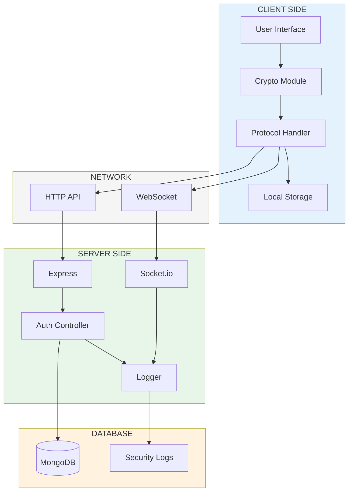
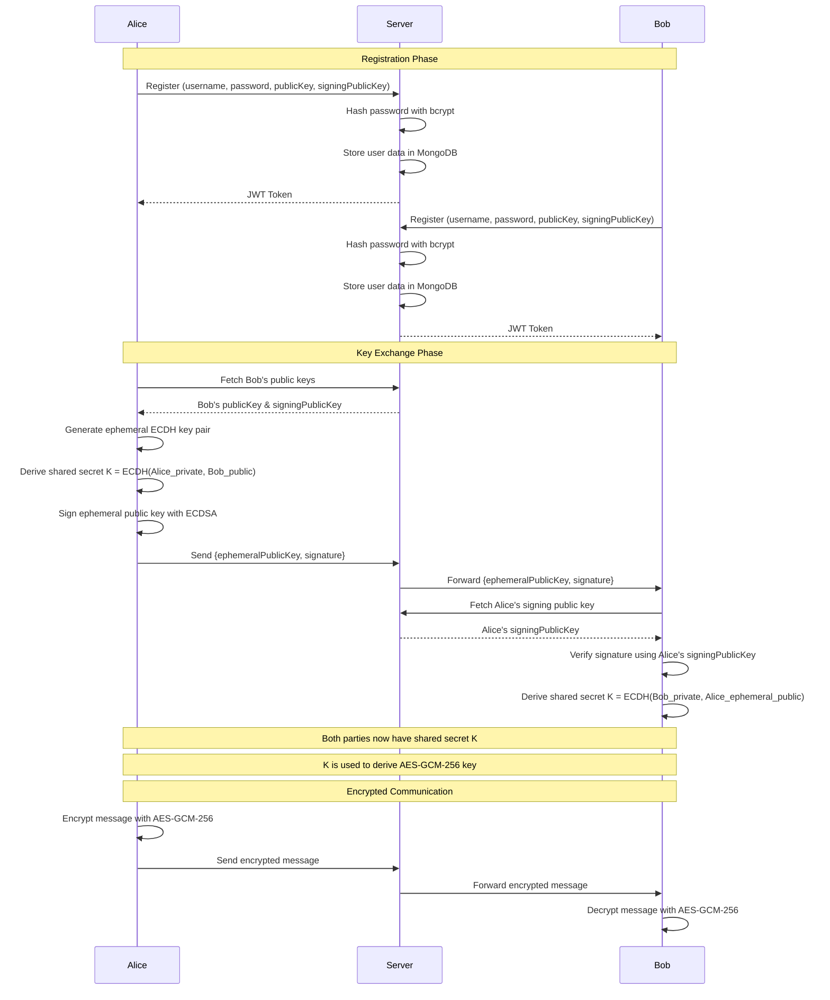
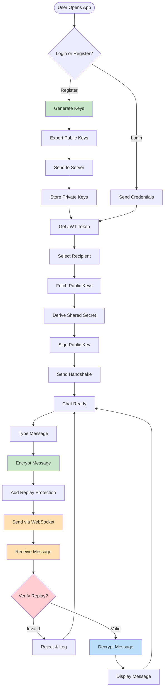
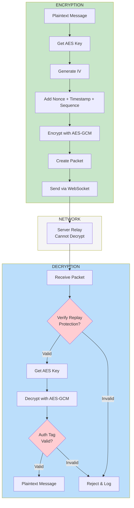
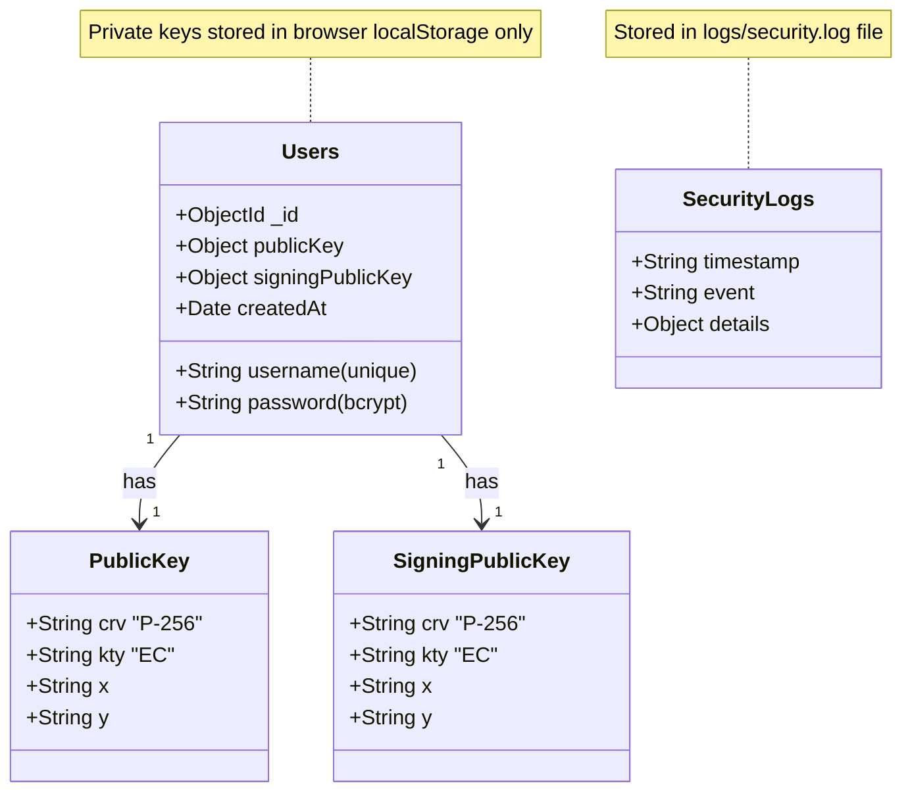
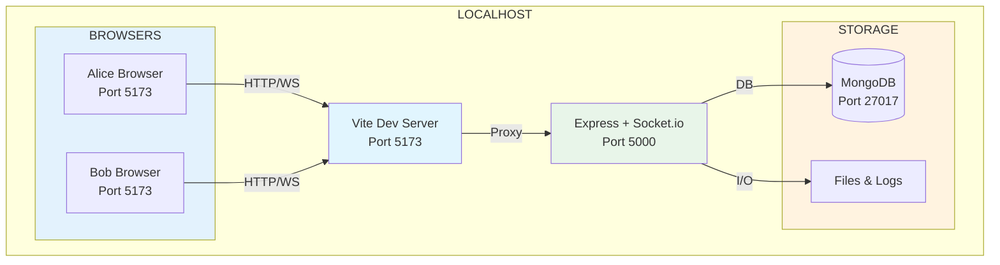

# Mermaid Diagram Codes

Copy and paste these codes into https://mermaid.live/ to generate the diagrams.

---

## 1. System Architecture Diagram



---

## 2. Key Exchange Protocol (Sequence Diagram)



---

## 3. Client-Side Flow Diagram



---

## 4. Encryption/Decryption Workflow



---

## 5. Database Schema



**Schema Details:**

### Users Collection (MongoDB)
- **_id**: ObjectId (Primary Key, auto-generated)
- **username**: String (unique, required, min 3 chars)
- **password**: String (bcrypt hash, required, min 6 chars)
- **publicKey**: Object (JWK format for ECDH)
  - crv: "P-256"
  - kty: "EC"
  - x: String (base64url)
  - y: String (base64url)
- **signingPublicKey**: Object (JWK format for ECDSA)
  - crv: "P-256"
  - kty: "EC"
  - x: String (base64url)
  - y: String (base64url)
- **createdAt**: Date (auto-generated)

### Security Logs (File System)
- **Location**: `server/logs/security.log`
- **Format**: `[timestamp] [event] {details}`
- **Events**:
  - AUTH_REGISTER
  - AUTH_LOGIN_SUCCESS
  - AUTH_LOGIN_FAIL
  - KEY_FETCH
  - KEY_EXCHANGE_INIT
  - KEY_EXCHANGE_SUCCESS
  - INVALID_SIGNATURE
  - REPLAY_ATTACK_DETECTED
  - DECRYPTION_FAIL

### Security Notes
- ✅ **Private keys**: NEVER stored in database (only in browser localStorage)
- ✅ **Messages**: NEVER stored (end-to-end encrypted, ephemeral)
- ✅ **Passwords**: Hashed with bcrypt (10 salt rounds)
- ✅ **Public keys**: Stored in JWK format for distribution


---

## 6. Network Architecture (Local Deployment)



---

## How to Use:

1. Go to **https://mermaid.live/**
2. **Copy** one of the code blocks above (including the ` ```mermaid ` markers)
3. **Paste** into the left panel
4. The diagram will render on the right
5. Click **"Actions"** → **"PNG"** or **"SVG"** to download

## Tips:

- **Adjust styling**: Modify `fill` colors in the code
- **Edit text**: Change labels directly in the code
- **Resize**: Use the zoom controls in mermaid.live
- **Export**: Download as PNG, SVG, or copy the code

All diagrams are ready to use! 🎨
