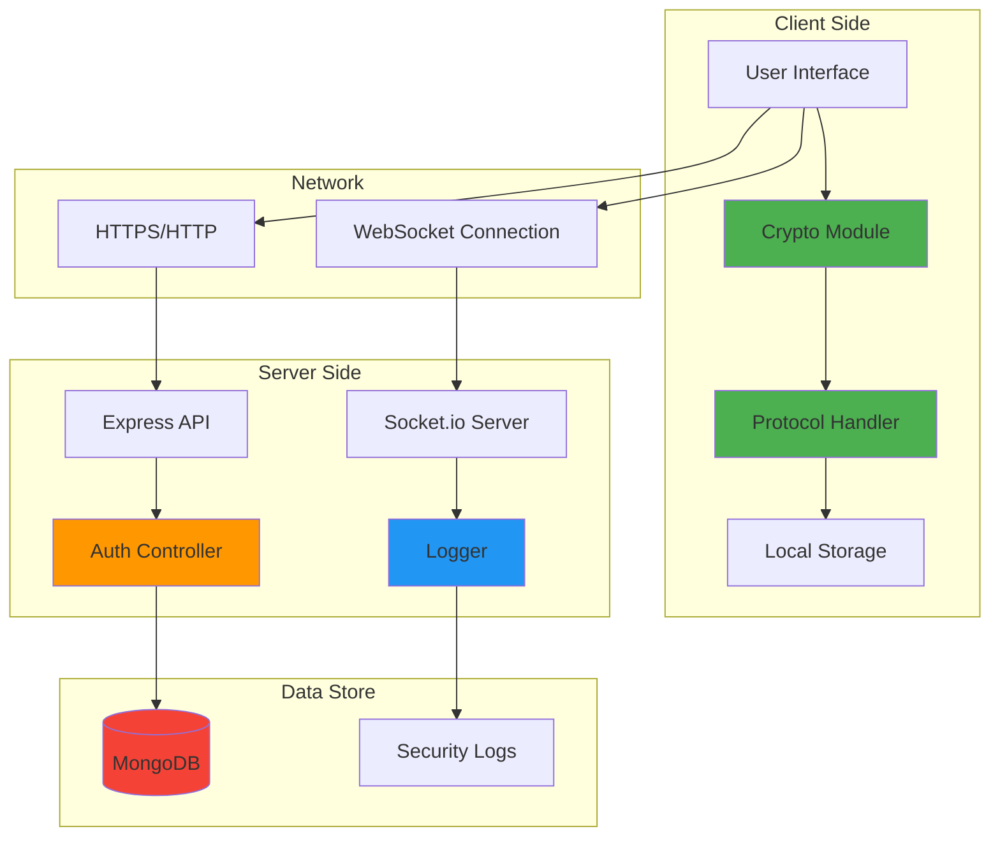
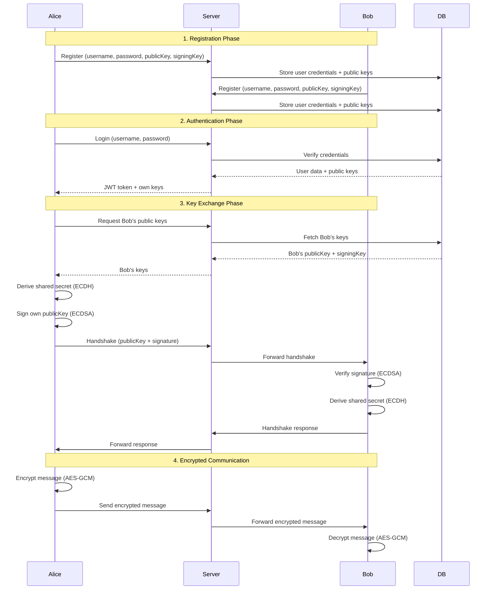

# STRIDE Threat Model: Secure End-to-End Encrypted Messaging System

## Table of Contents
1. [System Overview](#system-overview)
2. [System Architecture](#system-architecture)
3. [STRIDE Analysis](#stride-analysis)
4. [Threat-to-Defense Mapping](#threat-to-defense-mapping)
5. [Vulnerability Assessment](#vulnerability-assessment)

---

## System Overview

### System Description
A secure end-to-end encrypted messaging and file-sharing system that uses:
- **ECDH (Elliptic Curve Diffie-Hellman)** for key exchange
- **ECDSA (Elliptic Curve Digital Signature Algorithm)** for authentication
- **AES-GCM-256** for message encryption
- **WebSocket (Socket.io)** for real-time communication
- **MongoDB** for user credential and public key storage

### Key Components
1. **Client Application** (React + Vite)
2. **Server Application** (Node.js + Express + Socket.io)
3. **Database** (MongoDB)
4. **Communication Channel** (WebSocket over HTTP)

---

## System Architecture

### Data Flow Diagram

---

## STRIDE Analysis

### S - Spoofing (Identity Threats)

| Threat ID | Threat Description | Vulnerable Component | Risk Level | Implemented Defense |
|-----------|-------------------|---------------------|------------|-------------------|
| S1 | Attacker impersonates legitimate user during login | Authentication API | **HIGH** | ✅ Password hashing (bcrypt), JWT tokens |
| S2 | Man-in-the-middle impersonates Bob during key exchange | Key Exchange Protocol | **CRITICAL** | ✅ ECDSA digital signatures verify identity |
| S3 | Attacker registers with someone else's username | Registration API | **MEDIUM** | ✅ Unique username constraint in database |
| S4 | Session hijacking via stolen JWT token | Client-Server Communication | **HIGH** | ⚠️ HTTPS recommended (currently HTTP) |

**Key Countermeasures:**
- ✅ **Digital Signatures (ECDSA)**: Every key exchange includes a signature that proves the sender's identity
- ✅ **Password Hashing**: Bcrypt with salt prevents password compromise
- ✅ **JWT Authentication**: Stateless token-based authentication
- ✅ **Security Logging**: All authentication attempts logged

---

### T - Tampering (Data Integrity Threats)

| Threat ID | Threat Description | Vulnerable Component | Risk Level | Implemented Defense |
|-----------|-------------------|---------------------|------------|-------------------|
| T1 | MITM modifies public key during key exchange | WebSocket Channel | **CRITICAL** | ✅ Digital signatures detect tampering |
| T2 | Attacker modifies encrypted message in transit | Message Transport | **HIGH** | ✅ AES-GCM authenticated encryption |
| T3 | Database tampering (modify stored public keys) | MongoDB | **HIGH** | ⚠️ Database access control (deployment-dependent) |
| T4 | Attacker modifies client-side code | Client Application | **MEDIUM** | ⚠️ Code integrity checks recommended |

**Key Countermeasures:**
- ✅ **Authenticated Encryption (AES-GCM)**: Provides both confidentiality and integrity
- ✅ **Digital Signatures**: Any tampering with signed data is detected
- ✅ **Signature Verification Logging**: Invalid signatures are logged as `INVALID_SIGNATURE`

---

### R - Repudiation (Non-repudiation Threats)

| Threat ID | Threat Description | Vulnerable Component | Risk Level | Implemented Defense |
|-----------|-------------------|---------------------|------------|-------------------|
| R1 | User denies sending a message | Message Protocol | **MEDIUM** | ✅ Digital signatures prove sender identity |
| R2 | User denies authentication attempt | Auth System | **LOW** | ✅ Security logs record all auth attempts |
| R3 | User denies initiating key exchange | Key Exchange | **LOW** | ✅ Logs record `KEY_EXCHANGE_INIT` events |
| R4 | Admin denies security event occurred | Logging System | **MEDIUM** | ✅ Timestamped, immutable log files |

**Key Countermeasures:**
- ✅ **Comprehensive Security Logging**: All events logged with timestamps
- ✅ **Digital Signatures**: Cryptographic proof of message origin
- ✅ **Persistent Logs**: Stored in `logs/security.log` file

---

### I - Information Disclosure (Confidentiality Threats)

| Threat ID | Threat Description | Vulnerable Component | Risk Level | Implemented Defense |
|-----------|-------------------|---------------------|------------|-------------------|
| I1 | Eavesdropping on messages | WebSocket Channel | **CRITICAL** | ✅ End-to-end encryption (AES-GCM-256) |
| I2 | Server reads user messages | Server | **CRITICAL** | ✅ E2EE: Server only sees ciphertext |
| I3 | Database breach exposes messages | MongoDB | **CRITICAL** | ✅ Messages never stored, only metadata |
| I4 | Password exposure in database | User Collection | **HIGH** | ✅ Bcrypt hashing with salt |
| I5 | Private keys exposed in browser storage | LocalStorage | **CRITICAL** | ⚠️ Keys stored in localStorage (browser-dependent security) |
| I6 | Replay attack: attacker captures and resends old messages | Message Protocol | **HIGH** | ✅ Nonce + timestamp + sequence number |

**Key Countermeasures:**
- ✅ **End-to-End Encryption**: Messages encrypted on sender's device, decrypted on recipient's device
- ✅ **Key Derivation (ECDH)**: Shared secret never transmitted over network
- ✅ **Replay Protection**: Nonce, timestamp, and sequence numbers prevent replay attacks
- ✅ **Password Hashing**: Passwords never stored in plaintext

---

### D - Denial of Service (Availability Threats)

| Threat ID | Threat Description | Vulnerable Component | Risk Level | Implemented Defense |
|-----------|-------------------|---------------------|------------|-------------------|
| D1 | Flooding server with registration requests | Registration API | **MEDIUM** | ⚠️ Rate limiting recommended |
| D2 | WebSocket connection exhaustion | Socket.io Server | **MEDIUM** | ⚠️ Connection limits recommended |
| D3 | Database overload from log writes | Logging System | **LOW** | ⚠️ Log rotation recommended |
| D4 | Replay attack floods recipient with duplicate messages | Message Handler | **MEDIUM** | ✅ Replay protection rejects duplicates |

**Key Countermeasures:**
- ✅ **Replay Attack Protection**: Prevents message flooding via duplicate detection
- ⚠️ **Recommended**: Rate limiting, connection pooling, log rotation

---

### E - Elevation of Privilege (Authorization Threats)

| Threat ID | Threat Description | Vulnerable Component | Risk Level | Implemented Defense |
|-----------|-------------------|---------------------|------------|-------------------|
| E1 | Attacker accesses another user's messages | Message Routing | **CRITICAL** | ✅ E2EE: Only recipient can decrypt |
| E2 | Unauthorized access to security logs | Logs API | **MEDIUM** | ⚠️ No authentication on `/api/logs` endpoint |
| E3 | Attacker fetches any user's public keys | Keys API | **LOW** | ✅ Public keys are meant to be public |
| E4 | SQL/NoSQL injection in authentication | Auth Controller | **HIGH** | ✅ Mongoose ORM prevents injection |

**Key Countermeasures:**
- ✅ **End-to-End Encryption**: Cryptographic access control
- ✅ **ORM Usage**: Mongoose prevents NoSQL injection
- ⚠️ **Recommended**: Add authentication to logs endpoint

---

## Threat-to-Defense Mapping

| STRIDE Category | Threat | Implemented Defense | Code Location |
|-----------------|--------|-------------------|---------------|
| **Spoofing** | MITM impersonation | ECDSA Digital Signatures | `client/src/utils/protocol.js` |
| **Spoofing** | Fake login | Password hashing + JWT | `server/controllers/authController.js` |
| **Tampering** | Modified public key | Signature verification | `client/src/utils/protocol.js:50-54` |
| **Tampering** | Modified message | AES-GCM authentication | `client/src/utils/crypto.js:73-81` |
| **Repudiation** | Deny sending message | Digital signatures | `client/src/utils/protocol.js:38` |
| **Repudiation** | Deny auth attempt | Security logging | `server/controllers/authController.js:22,34,62,71` |
| **Information Disclosure** | Message eavesdropping | AES-GCM-256 encryption | `client/src/utils/crypto.js:56-70` |
| **Information Disclosure** | Replay attack | Nonce + timestamp + sequence | `client/src/utils/replayProtection.js` |
| **Denial of Service** | Replay flooding | Duplicate detection | `client/src/utils/replayProtection.js` |
| **Elevation of Privilege** | Read others' messages | E2EE (only recipient has key) | `client/src/utils/protocol.js:22-28,66-72` |

---

## Vulnerability Assessment

### Critical Vulnerabilities (Mitigated)
✅ **MITM Attack**: Prevented by ECDSA signatures  
✅ **Message Interception**: Prevented by E2EE  
✅ **Replay Attacks**: Prevented by nonce/timestamp/sequence  

### High-Risk Vulnerabilities (Partially Mitigated)
⚠️ **No HTTPS**: Currently using HTTP (should use HTTPS in production)  
⚠️ **LocalStorage Key Storage**: Browser-dependent security (consider WebCrypto non-extractable keys)  

### Medium-Risk Vulnerabilities (Recommended Improvements)
⚠️ **No Rate Limiting**: Vulnerable to brute-force and DoS  
⚠️ **Unauthenticated Logs Endpoint**: Anyone can view security logs  
⚠️ **No Session Timeout**: JWT tokens don't expire frequently enough  

### Low-Risk Vulnerabilities
⚠️ **No Log Rotation**: Logs could grow indefinitely  

---

## Screenshots for Report

### Screenshot 1: Architecture Diagram
- Copy the Mermaid diagram code above
- Use an online tool like [Mermaid Live Editor](https://mermaid.live/) to render it
- Take a screenshot of the rendered diagram

### Screenshot 2: Data Flow Diagram
- Copy the sequence diagram code above
- Render it in Mermaid Live Editor
- Take a screenshot

### Screenshot 3: STRIDE Threat Tables
- Take screenshots of each STRIDE category table from this document
- You can also create these tables in Excel/Word for better formatting

### Screenshot 4: Threat-to-Defense Mapping
- Screenshot the mapping table showing how each threat is addressed

### Screenshot 5: Code Evidence
- Screenshot the signature verification code in `protocol.js`
- Screenshot the encryption code in `crypto.js`
- Screenshot the replay protection code in `replayProtection.js`
- Screenshot the logging code in `authController.js`

---

## Summary

This STRIDE threat model demonstrates that the system has **strong cryptographic defenses** against the most critical threats:
- ✅ **Spoofing**: Digital signatures + password hashing
- ✅ **Tampering**: Authenticated encryption + signature verification
- ✅ **Repudiation**: Comprehensive logging + digital signatures
- ✅ **Information Disclosure**: End-to-end encryption + replay protection
- ⚠️ **Denial of Service**: Partial protection (replay detection)
- ✅ **Elevation of Privilege**: Cryptographic access control

**Recommended Improvements:**
1. Deploy with HTTPS/TLS
2. Add rate limiting
3. Implement authentication on logs endpoint
4. Use non-extractable keys in WebCrypto
5. Add log rotation
